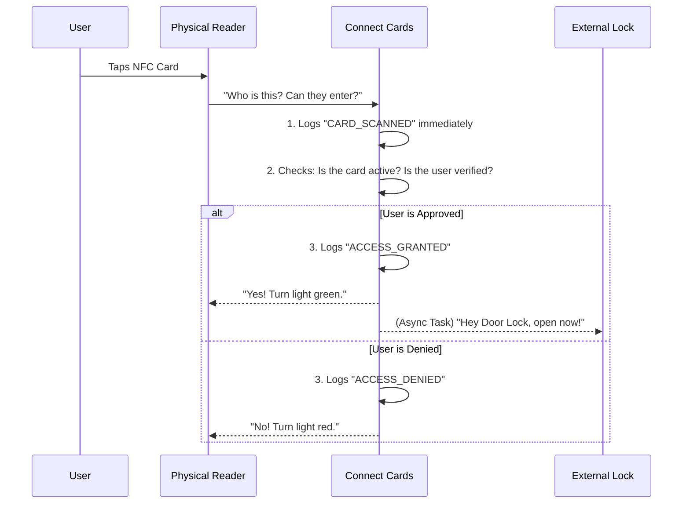

# Connect Cards Platform: Non-Technical Overview

## 🎯 Project Goal
The **Connect Cards Platform** is a modern, secure, and flexible access-control and identity management system. Its primary goal is to bridge the physical world (smart NFC cards and readers) with the digital world (software, permissions, and real-time events). 

Instead of traditional, hard-to-manage physical keys, this system uses assignable digital identities and real-time communication to determine exactly **who** is allowed to go **where**, and **when**.

---

## 🏗️ Core Concepts (The Building Blocks)

To understand how the system works, it helps to know the main "actors" in the ecosystem:

1. **Organizations & Projects** 
   - **Organizations:** The main companies or entities using the software (e.g., "Acme Corp").
   - **Projects:** Sub-divisions within that organization (e.g., "Headquarters Building", "Offsite Event - Summer 2026").

2. **Identities & Memberships**
   - **Identities:** The actual people (employees, guests, members).
   - **Memberships:** The official link that proves a person belongs to an Organization, dictating what roles or permissions they hold.

3. **Cards & Readers (The Hardware)**
   - **Cards (NFC):** Physical smart cards or chips carried by users. They don't store personal data; they only hold a unique serial number (UID) that safely identifies them to the system.
   - **Readers:** The physical scanning devices installed at doors, turnstiles, or check-in desks. Readers belong to specific Projects.

4. **Events & Webhooks (The Brains & Nerves)**
   - **Events:** The system's memory. Every single action is recorded as an event (e.g., *Card Issued, Card Scanned, Access Granted, Access Denied*).
   - **Webhooks (Event Dispatcher):** The nervous system. It's an automated messenger that securely pings third-party software in real-time. For example, telling a physical door lock to click open the millisecond an "Access Granted" event occurs.

---

## 🔄 How the Core Flows Work

Here are the everyday scenarios the platform handles, translated from code to plain English.

### 1. The Onboarding Flow (Giving someone a card)
*How does a blank piece of plastic become a secure key?*

1. **Registration:** An Administrator adds a new person (Identity) to their system and grants them a Membership.
2. **Issuing the Card:** The system takes a blank NFC card, assigns it a secure "Activation Code", and puts the card in a "Pending" state.
3. **Activation:** The user receives the card and enters their secret Activation Code on a portal. The system securely links the physical card's UID to their digital Identity. The card is now **Active**.

### 2. The Access/Scanning Flow
*What happens in the blink of an eye when a card is tapped?*

When a user taps their card on a reader, a complex but lightning-fast series of checks occurs:

**Behind the scenes:**
Even if the physical reader is slow or the internet drops slightly, the software uses **"Asynchronous Background Tasks"**. This means the system instantly tells the reader "Yes" or "No" without making the person wait at the door, while the background software cleanly records the event in the database and fires off signals to other software.

### 3. The Security & Revocation Flow (Lost Cards)
If someone loses their card, an administrator can instantly hit "Revoke". 
Because the intelligence lives in the cloud (not on the card itself), the physical card instantly becomes useless. The system severs the link between the identity and the card. If someone finds the lost card and tries to tap it, the system simply returns `ACCESS_DENIED`.

---

## ⚡ Key Technical Selling Points (For Stakeholders)

- **Highly Modular:** The software isn't a tangled mess. Tasks are separated into precise worker modules (e.g., the *Scanner* doesn't handle *Emails*; it just hands the task to the *Dispatcher*). 
- **Zero-Block Performance:** Checking a card takes milliseconds. The heavy lifting (like writing audit logs to the database or talking to external door software) happens invisibly in the background.
- **Hardware Agnostic:** Because the system communicates using standard internet protocols (Webhooks), it doesn't care if the company buys Reader Brand A or Reader Brand B, as long as they can talk to the API.
